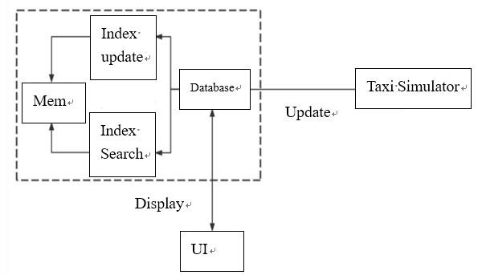

Location-based services (LBS) emerge with the rapid rise of big data and the Internet, which provides a new service and business model for Internet enterprises, and also brings users a more pleasant and convenient experience of using the Internet. Internet service platforms for taxis and other vehicles provide positioning-based "taxi" services for users. On the surface, the user only needs to open the software and click on the destination to "call" the nearest idle taxi according to the current location; in fact, after receiving the client's request and the client's current location report, the server can find the nearest taxi according to a specific algorithm and return its information to the client (usually mobile devices such as mobile phones). 

The main purpose of the project is to combine the scientific data organization and access ideas in the data structure with the actual situation, and finally complete a nearest neighbor query and range query algorithm which can basically achieve the purpose of small space-time overhead and combine it with other servers and client programs.

Simulation System Structure
