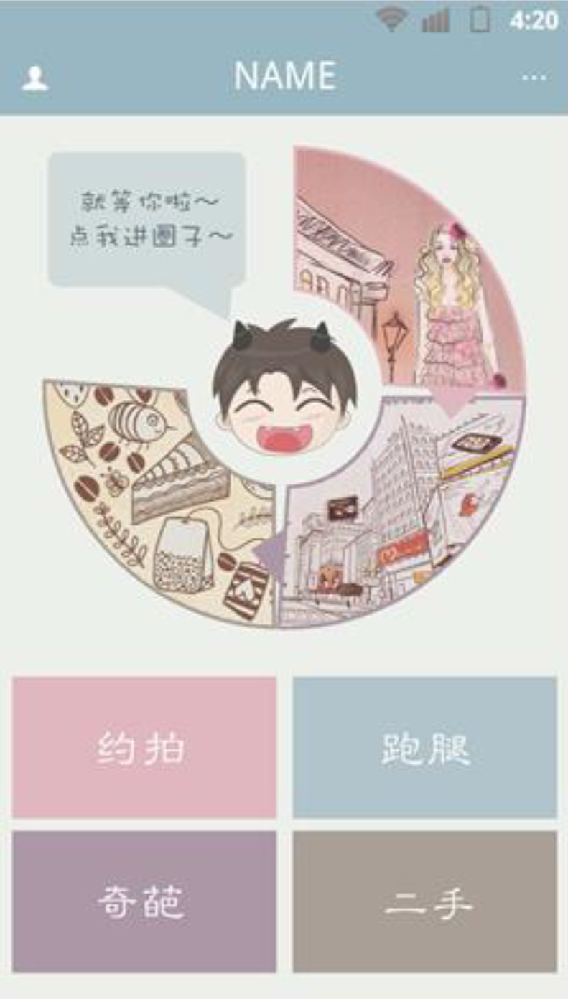
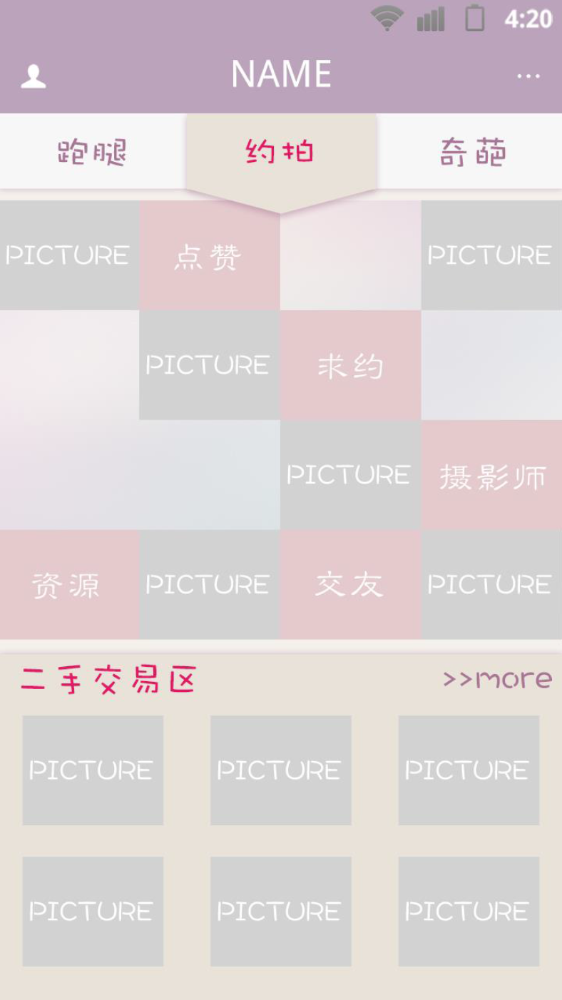

This is a national-level college student innovative project and I am the leader in it. This project plans to develop and operate a trading platform for on-campus services (crowdsourcing) and second-hand goods. Currently in our university, we do not have enough platform to share and acquire sufficient service provided by others. We aim at designing a platform to balance these resources. 
After much investigation through offline and online survey of what functions we should provide, we separate designed the application as follows. There are two main parts. In part one, users can post their request or need on our platform. The other part is specifically designed for second-hand trading. We have already implemented the application and trying to make it into real use.

   
